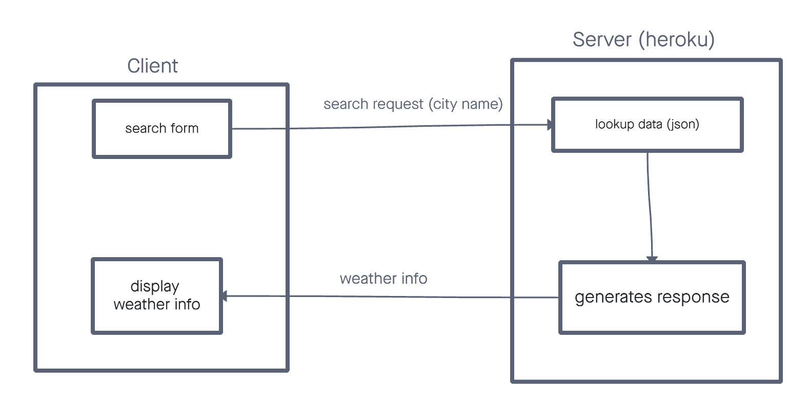
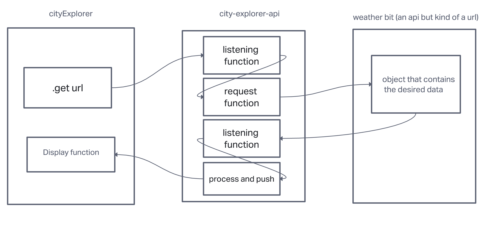
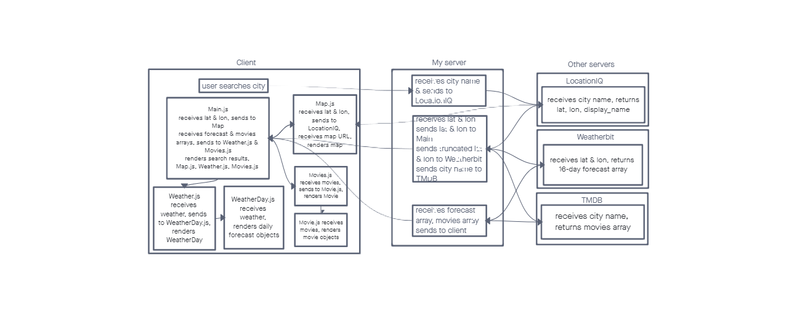
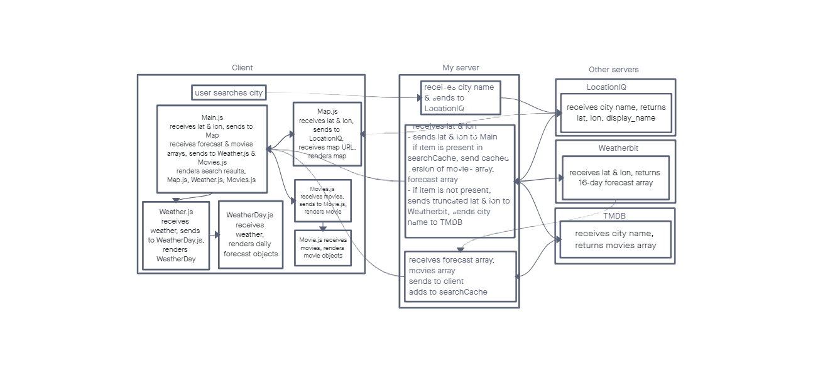

# City Explorer

**Author**: Lucy Gelderloos
**Version**: 1.0.0

## Overview

This application allows the user to search for a city and see current weather, a map of the city center, and relevant movies.

## Getting Started
<!-- What are the steps that a user must take in order to build this app on their own machine and get it running? -->

## Architecture

## Change Log
<!-- Use this area to document the iterative changes made to your application as each feature is successfully implemented. Use time stamps. Here's an example:

01-01-2001 4:59pm - Application now has a fully-functional express server, with a GET route for the location resource. -->

## Credit and Collaborations

### Lab Partners

- Austin Limanek
- TJ Parker & Trevor Stephens
- Kyel Boisseau

### Resources

- [Using the LocationIQ API](https://www.youtube.com/watch?v=ZXT8i0qR2vE)
- Map image by [Waldemar Brandt]("https://unsplash.com/@waldemarbrandt67w?utm_source=unsplash&utm_medium=referral&utm_content=creditCopyText") on [Unsplash](https://unsplash.com/?utm_source=unsplash&utm_medium=referral&utm_content=creditCopyText")

## Time Estimates

### Lab 6, Feature 1: Set up Repo & API keys (branch lab-06)

Estimate of time needed to complete: 1.5h

Start time: 12:45 PM

Finish time: 1:30 PM

Actual time needed to complete: 45m

### Lab 6, Feature 2: Locations

Estimate of time needed to complete: 3h

Start time: 3:00 PM

Finish time: 7:30 PM

Actual time needed to complete: 4.5h

### Lab 6, Feature 3: Map

Estimate of time needed to complete: 2h

Start time: 7:30 PM Monday

Finish time: 4:45 PM Wednesday

Actual time needed to complete: 2.5h

### Lab 6, Feature 4: Error

Estimate of time needed to complete: 1h

Start time: 9:00 PM Monday

Finish time: 4:00 PM Wednesday

Actual time needed to complete: 1.5h

### Lab 7, Feature 1: Weather

Estimate of time needed to complete: 2h

Start time: 10:00 PM Tuesday

Finish time: 8:30 PM Wednesday

Actual time needed to complete: 3h

### Lab 8, Feature 1: Live Weather

Estimate of time needed to complete: 1.5h

Start time: 8:30 PM Wednesday

Finish time: 9:00 PM Wednesday

Actual time needed to complete: 1h

### Lab 8, Feature 2: Movies

Estimate of time needed to complete: 1.5h

Start time: 9:00 PM Wednesday

Finish time: 10:30 PM Wednesday

Actual time needed to complete: 1.5h

### Lab 8, Feature 3: Publish

Estimate of time needed to complete: 1h

Start time: 10:30 PM Wednesday

Finish time: 11:30 PM Wednesday

Actual time needed to complete: 1h

### Lab 9, Feature 1: Modularize

Estimate of time needed to complete: 2h

Start time: 3:00 PM Thursday

Finish time: 11:30 AM Saturday

Actual time needed to complete: 4h

### Lab 9, Feature 2: Componentize

Estimate of time needed to complete: 2h

Start time: 3:00 PM Thursday

Finish time: 11:30 AM Saturday

Actual time needed to complete: 4h

### Lab 10, Feature 1: Performance

Estimate of time needed to complete: 4h

Start time: 3:00 PM Sunday

Finish time: 7:30 PM Sunday

Actual time needed to complete: 4.5h
